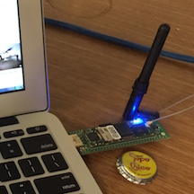

[](https://twitter.com/hackgnar)

# The SEWiFi Project


## Summary
* **NOTE:** All documentaion and code hosted here is a huge work in progress.  Im in the process of writing docs, porting existing code and cleanup.
* The SEWiFi project aims to create a security enhanced WiFi USB dongle.  The USB device for this project is based on a Debian ARM distribution which masqurades as a USB WiFi dongle which passes a host computers network traffic though a full security stack (i.e. Firewall, IDS, IPS, VPN, etc).
* The project is currently in its early stages.
* The current hardware for this project is a Gumstix Overo ARM board with an Overo Thunbo daughter board.
* The base OS is a tweeked Debian ARM Linux distribution which can be installed on a base Debian system with a single deb package.
* Precompiled images of the project can be obtained [here](https://github.com/hackgnar/gumstix-overo-images/blob/master/sewifi)

## Install SEWiFi to a Gumstix Overo with Thumbo board
### (option 1) Download preconfigured image
* Documentation can be found [here](https://github.com/hackgnar/gumstix-overo-images/blob/master/sewifi/build_precompiled_image.md)

### (option 2) Build your own image 
* Documentation can be found [here](https://github.com/hackgnar/gumstix-overo-images/blob/master/sewifi/build_manually.md)

### (option 3) Install the SEWIFI overlay deb to a preexisting Gumstix Overo Debian system
* if you are already running Debian on a Gumstix Overo board you can simply do the following

#### Add the sewifi apt repo
````
cat << EOF > sewifi/etc/apt/sources.list
deb https://raw.githubusercontent.com/hackgnar/sewifi/master/apt-repo main
EOF
apt-get update
````

#### Install the Overlay Package
````
apt-get install sewifi-gumstix-overo
````

## Current State
In its current state the project is very much useable by seasoned Linux users.  Most of the work that needs to be done revolves around making the device affordable, easy to use by everyday users, and adding more security tools.  Once your device is up and running it is currently only configurable via ssh.  These configurations include setting up wifi credentials, setting VPN credentials, viewing and taking action on IDS rules, etc. 

Currently, to configure the device, do the following:

1. Plug it into a host computers USB port and wait for it to serve you up a DHCP address on your USB network interface
2. SSH to 172.16.1.2 with username root and password hackgnar.  Note, you should eventualy change your password.
3. Set a wifi network up in /etc/network/interfaces
4. Setup VPN credentials if desired
5. Make the device your default route or simply turn off your host computers wifi and unplug and wired network connetions.
6. Thats it... All network connections will now be filtered though the devices firewall, IDS, VPN, etc software.

## Future Work
1. Making the SEWiFi device easy to use for everyday users.
    * Web configuration console
    * Masquirade as popular USB wifi device
2. Making the hardware for the SEWiFi project more affordable.
    * This is currently a work in progress.  I am looking at a different board which would bring the price point closer to $50 instead of $200
3. Making the hardware for the SEWiFi project smaller.
    * This is also a work in progress.  The board mentioned above will reduce the size considerably. 
4. Adding actions triggered by ISD alerts.
    * This requires some simple customization of the systems current IDS (BRO).  This should be added fairly soon.
    * Notable alerts should also be propigated to the user.
5. Adding more security tools to the base image. 
    * There are many other tools which can be included in the base image.  Some of these include:
        * Tor
        * DNSSec
        * Alternate IDSs for the Bro haters
        * HTTPS encapsulation for non SSL traffic
        * many many more...
